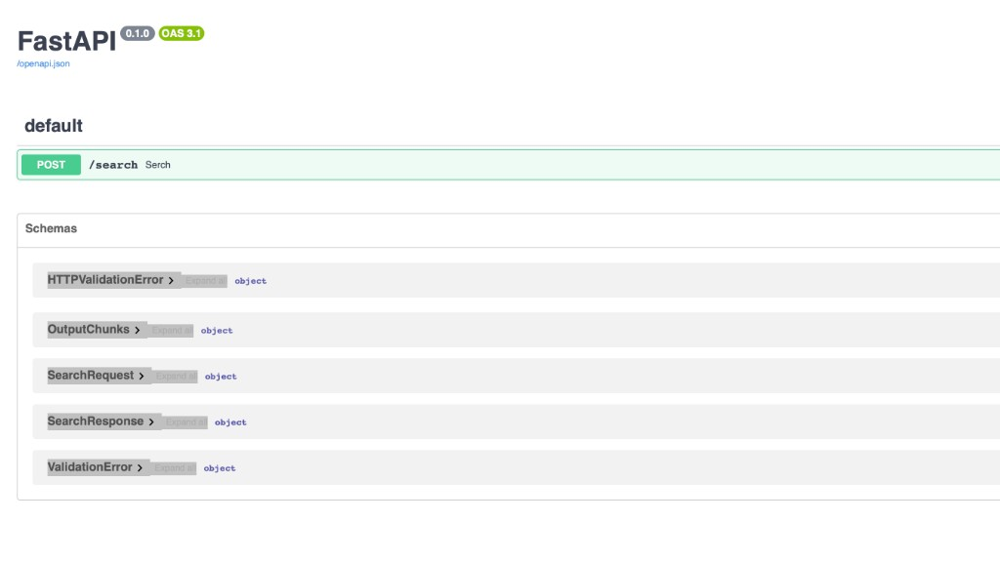

# PDF Search API

A semantic search backend for French public documents (parliamentary proceedings, public hearings, official reports). Built with FastAPI, FAISS, and a multilingual HuggingFace embedding model.

No paid external APIs required — runs entirely locally.

---

## Prerequisites

- [Docker](https://docs.docker.com/get-docker/) with Compose installed

---

## Environment variables (`.env`)

The project includes a `.env` file at the repository root.(you have .env.example)

1. **Docker Compose** — Compose automatically reads `.env` for variable substitution in `docker-compose.yml` (for example `${PDF_DIR}`).

Default contents:

```env
STORAGE=./storage
```

---

## Quick start

```

PDF_DIR=./pdf docker compose up
```

The API is available at `http://localhost:8000`.  
On first run the embedding model is downloaded from HuggingFace (~120 MB).

---


What happens on `docker compose up`

1. **`ingest` service** starts first — reads all `.pdf` files from `PDF_DIR`, generates embeddings and writes the FAISS index to `./storage/`.
2. **`api` service** starts automatically once ingestion is complete — serves search results from the same index.

### Verify the index was created

```bash
ls storage/
# should contain: docstore.json  default__vector_store.json  index_store.json
```

### 5. Call the /search endpoint

```bash
curl -X POST http://localhost:8000/search \
  -H "Content-Type: application/json" \
  -d '{"query": "Quelle est la position du document sur les politiques publiques ?", "top_k": 5}'
```

Example response:

```json
{
  "query": "Quelle est la position du document sur les politiques publiques ?",
  "results": [
    {
      "document_name": "example.pdf",
      "page_number": 3,
      "chunk_index": 12,
      "score": 0.82,
      "text": "Contenu du passage correspondant..."
    }
  ]
}
```

`score` is a cosine similarity — higher means more similar.

### FastAPI interactive docs

Once the API is running, open Swagger UI at [http://localhost:8000/docs](http://localhost:8000/docs). You can try `POST /search` directly in the browser — no `curl` needed.



### 6. Rebuild the index when PDFs change

```bash
rm -rf storage/*
PDF_DIR=./pdf docker compose up
```

---

## How persistence works

```
Your machine              Docker containers
────────────              ─────────────────
$PDF_DIR/   ──────────►   /app/pdf/    (ingest reads PDFs)
./storage/  ◄──────────►  /app/storage (index written by ingest, read by api)
```

The `./storage/` folder is created automatically and persists on your machine after containers stop.


---

## Solution Review
So about my thoughts, and my approach:

- I made a search on Internet of pdf parcing libraries and discovered llama_index, I have choosed it because it has compatibility with FAISS, which makes it very easy to connect vectores to metadate and make search.
- During developpemnt I used L2 method for creating the embeddings, and than discoverd that the Cosine is standart for work with the text so I choosed IndexFlatIP
- During the api developpement for query function I used to read index each time from the disk and than make queries it. Beacause it was not effective, I decided to use fastapi lifespan to load from the disk index one time during the start of the service and persist it while FastAPi is on.
- Because our function of quering is sync, it will block the event loop of FastAPi,if we dont run it in the separate thread (loop.run_in_executor), but becasue for our purpoused it is not needed i left serach FastAPi function synchronic but for production I will use async approach more about it.
 - Also I have added the docker compose to facilitate the life and to give possibility to start the app only with one command


### Main limitations

- **Single shared FAISS index for all documents** — adding one new PDF requires either a full rebuild or an append that touches the whole index file.
- **No text cleaning** — headers, footers, page numbers and formatting artefacts from PDFs are indexed as-is.

### Situations where search quality may be poor

- **Short or very common queries** — generic words like "budget" or "commission" match too many chunks equally and the ranking is not meaningful.
- **Queries in a different language than the document** — the multilingual model handles cross-lingual search reasonably well for close language pairs, but accuracy drops for distant languages.
- **Documents with very similar content** — if many PDFs cover the same topics, results may be dominated by the largest document because FAISS returns the globally nearest vectors regardless of document diversity.
- **Long documents with many chunks** — a single large document dominates `top_k` results even for queries that belong to a smaller document.


### What I would improve with additional time

- **Add a `/ingest` endpoint** — so re-indexing can be triggered via HTTP without restarting containers.
- **Improve text extraction** — strip page headers/footers and normalise whitespace before chunking.

### What I would add for a production-ready version

- **Per-document filtering** — let the client pass `document_name` to restrict search to a specific file.
- **Persistent vector database** — replace flat-file FAISS with a proper vector DB (Qdrant, Weaviate, pgvector) to support concurrent writes, filtering, and scalable retrieval.
- **Authentication** — API key or OAuth2 middleware before exposing `/search` externally.
- **Structured logging and health check** — `GET /health` endpoint, request tracing, error monitoring.
